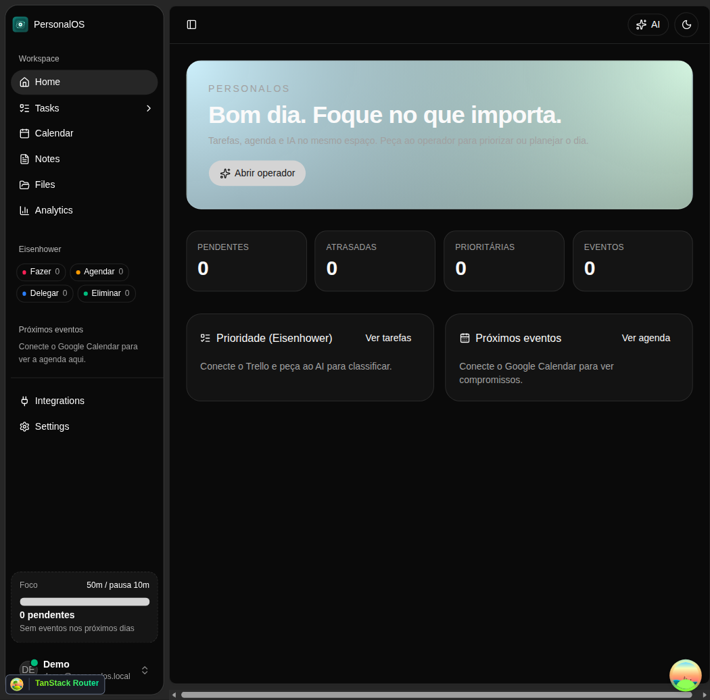
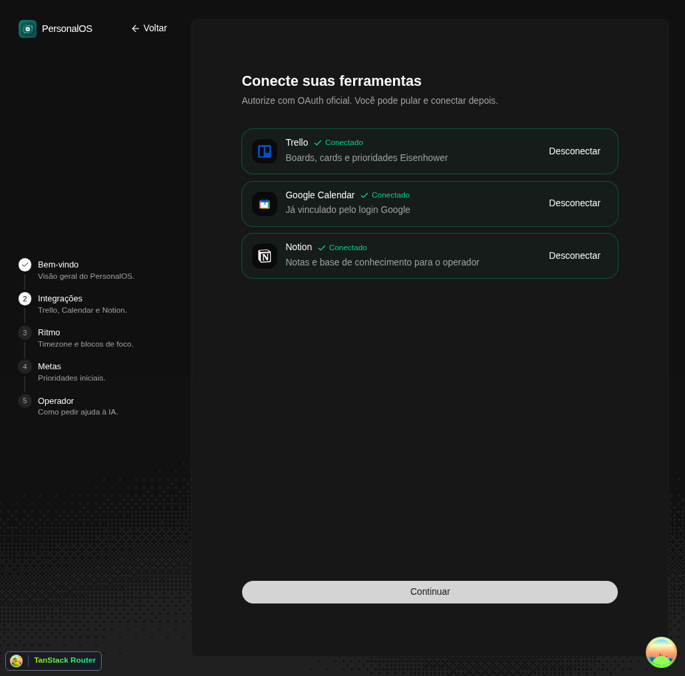
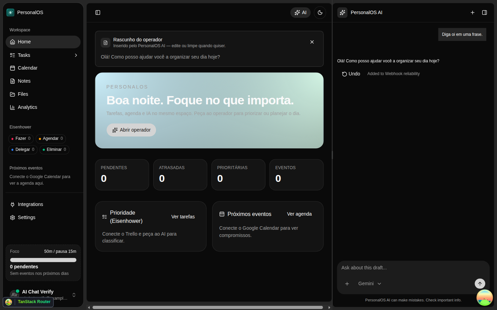
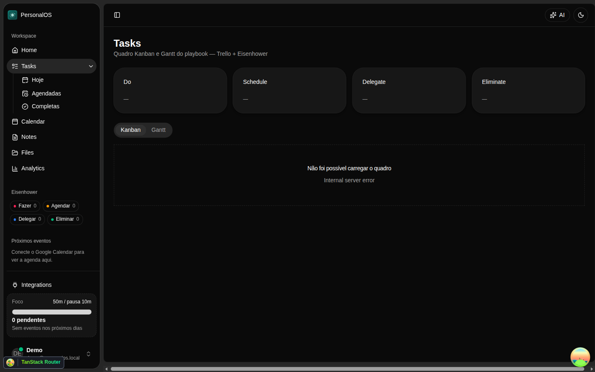
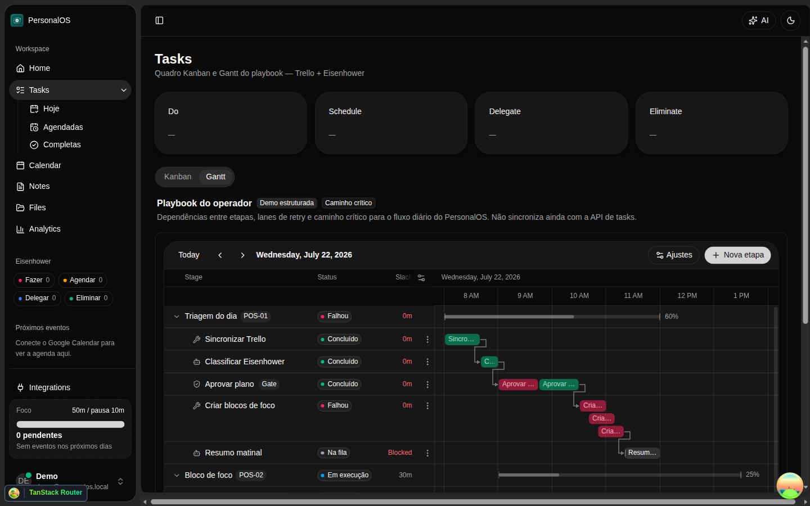

# PersonalOS

Sistema operacional pessoal (POS) com dashboard, matriz de Eisenhower, time blocking e operador de IA. Integra **Trello**, **Google Calendar** e **Notion** para organizar tarefas, compromissos e conhecimento em um único shell web (desktop Tauri opcional).

Documentação acadêmica (teoria ↔ produto, ABNT simplificada): [`docs/entrega/Documentacao.pdf`](./docs/entrega/Documentacao.pdf) — regenerar com `bun run docs:entrega-pdf`.

## O que o MVP entrega

| Área | O que existe hoje |
|------|-------------------|
| Home `/` | KPIs (pendentes, atrasadas, prioritárias) e visão do dia |
| Tarefas `/tasks` | Grade Eisenhower, filtros Hoje/Agendadas, boards Kanban e Gantt |
| Calendário `/calendar` | Eventos do Google Calendar |
| Integrações `/integrations` | Conectar Trello, Calendar e Notion; BYOK Claude/ChatGPT |
| Operador de IA | Dock/sheet (Cmd/Ctrl+K): classificar, planejar o dia, blocos de foco, comunicação, Notion |
| Onboarding | Conectar apps, timezone, horário de trabalho e intro do operador |
| Arquivos `/files` | Upload de PDF com extração de texto |
| Analytics `/analytics` | Contagens básicas (sem score de horas) |
| Auth | E-mail/senha, Google, GitHub, magic link (Resend) |

**Fora do MVP (melhoria futura):** Gmail. O backend tem scaffolding OAuth, mas a UI de Integrações e o onboarding **não** exibem Conectar Gmail. Notes (`/notes`) ainda é uma ponte textual para o operador.

## Previews

<p>
  
</p>

<p>
  
</p>

<p>
  
</p>

<p>
  
  
</p>

Checklist de prints sugeridos para a entrega: login, onboarding, dashboard, Eisenhower/tarefas, operador com tool steps, integrações conectadas, upload de PDF, (opcional) app Tauri.

## Stack

| Camada | Tecnologia |
|--------|------------|
| Frontend | React 19, TanStack Router/Query, Tailwind 4, shadcn/ReUI |
| Backend | Fastify, oRPC, Better Auth |
| IA | Vercel AI SDK (`ai`, `@ai-sdk/react`) + Gemini/Claude/ChatGPT |
| Dados | PostgreSQL, Drizzle ORM |
| Monorepo | Turborepo, Bun |
| Desktop | Tauri 2 (opcional) |

Base inicial: [Better-T-Stack](https://github.com/AmanVarshney01/create-better-t-stack).

## Como executar localmente

Pré-requisitos: **Bun 1.3+**, PostgreSQL (Docker ou sistema) e variáveis de ambiente.

1. Copie o modelo [`.env.example`](./.env.example) para `apps/server/.env` e `apps/web/.env`.
2. Preencha pelo menos `DATABASE_URL`, `BETTER_AUTH_SECRET`, `BETTER_AUTH_URL`, `CORS_ORIGIN` e `INTEGRATION_ENCRYPTION_KEY`. Integrações e login social pedem as chaves OAuth descritas no exemplo.

```bash
bun install
bun run db:start    # Postgres (Docker ou scripts/ensure-postgres.sh no Cloud Agent)
bun run db:push
bun run dev
```

- Web: http://localhost:3001
- API: http://localhost:3000

Apenas um app: `bun run dev:web` ou `bun run dev:server`. Desktop: `cd apps/web && bun run desktop:dev`.

### Redirects OAuth (resumo)

Registre no console do provedor (valores locais):

| Fluxo | Callback |
|-------|----------|
| Google login + Calendar Connect | `http://localhost:3000/api/auth/callback/google` |
| GitHub login | `http://localhost:3000/api/auth/callback/github` |
| Notion Connect | `http://localhost:3000/api/integrations/oauth/notion/callback` |
| Trello | `http://localhost:3001/oauth/trello` |

Detalhes e armadilhas (`redirect_uri_mismatch`, Power-Up hex key do Trello): ver comentários em [`.env.example`](./.env.example).

## Estrutura

```
personal-os/
├── apps/
│   ├── web/         # React + TanStack Router (+ Tauri)
│   └── server/      # Fastify, oRPC, auth, AI, OAuth
├── packages/
│   ├── api/         # Routers oRPC
│   ├── auth/        # Better Auth
│   ├── capabilities/# Eisenhower, planning, operator tools
│   ├── db/          # Drizzle + schema
│   ├── integrations/# OAuth e adapters
│   └── ui/          # shadcn/ReUI compartilhado
└── docs/
    ├── entrega/     # Documentacao.md → Documentacao.pdf
    └── previews/    # Screenshots do produto
```

## Scripts úteis

| Comando | Função |
|---------|--------|
| `bun run dev` | Sobe web + server |
| `bun run check-types` | Typecheck do monorepo |
| `bun run db:push` / `db:studio` | Schema e Drizzle Studio |
| `bun run docs:entrega-pdf` | Regenera `docs/entrega/Documentacao.pdf` |
| `bun run deploy` / `deploy:prod` | Deploy Vercel (após `deploy:setup` e sync de env) |

## Entrega acadêmica

| Entregável | Onde |
|------------|------|
| Parte teórica + prática (PDF) | [`docs/entrega/Documentacao.pdf`](./docs/entrega/Documentacao.pdf) |
| README / como rodar | Este arquivo |
| Vídeo pitch (≤4 min) | Link externo (YouTube, Loom ou Drive) — fora do repositório |

Autor: João Henrique Benatti Coimbra · RA 188635 · UniFECAF · Módulo Produtividade e Gestão do Tempo.
